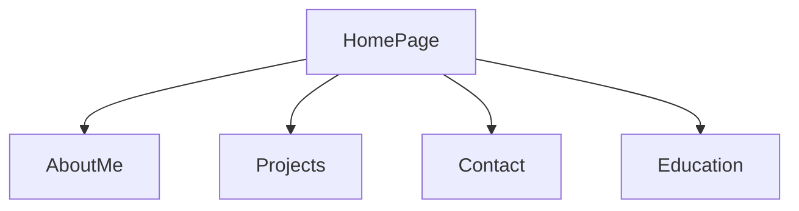

This flowchart represents the layout I would follow if i were to make a personal website. The home page would provide a brief over view of the site and would contain links to the other web pages. Projects web page would consist of anything I have done with computers or tech related things that would be worthy to put on there. Contact page would be a page with socials or email for contact. Education page would list my education and educational resources.